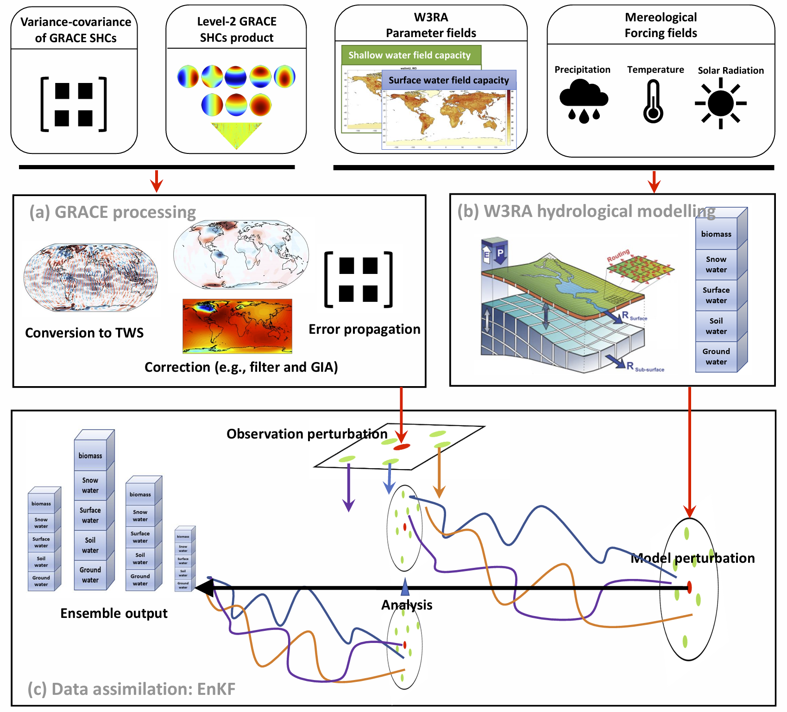

# PyGLDA: a fine-scale Python-based Global Land Data Assimilation system for integrating satellite gravity data into hydrological models

## Description
Data assimilation (DA) has been widely used to merge the hydrological 'model' and 
the satellite gravity based 'observations', to complement each other towards a better 
temporal, horizontal and vertical disaggregation of the terrestrial water storage estimates.
We hereby present a free, open-source, parallel and Python based PyGLDA 
system to address the challenges of the High-Resolution Global DA (HRGDA) for GRACE
and W3RA hydrologocal model (up to 0.1 degree and daily).

When referencing this work, please cite: 
> Yang, F., Schumacher, M., Retegui-Schiettekatte, L., van Dijk, A. I. J. M., and Forootan, E.: PyGLDA: a fine-scale Python-based Global Land Data Assimilation system for integrating satellite gravity data into hydrological models, Geosci. Model Dev. Discuss. [preprint], https://doi.org/10.5194/gmd-2024-125, 2024.

## Developer and contact
- Fan Yang (fany@plan.aau.dk)
- Ehsan Forootan (efo@plan.aau.dk) 
- Leire Retegui-Schiettekatte (leirears@plan.aau.dk) 
- Maike Schumacher (maikes@plan.aau.dk)

We are from Geodesy Group (see https://aaugeodesy.com/), Department of Sustainability and Planning, Aalborg University, Aalborg 9000, Denmark

This work is supported by the Danmarks Frie Forskningsfond [10.46540/2035-00247B] through the DANSk-LSM project. Additional supports come from and national Natural Science Foundation of China (Grant No. 42274112 and No. 41804016). We also acknowledge the support of W3RA model via https://www.dropbox.com/scl/fo/b0hneugr9vao0rqm4oh86/AEPPU-QG6kgh9wTlIBgiwMQ?rlkey=q7ux08mitdghnoac3e4spwaev&e=1&dl=0

## Important information

- Please download the code and auxiliary data from https://drive.google.com/drive/folders/1ZDU9oUnpUaTC9H9Bv4spZa8-_z9d-9Ib, which is a version specified for demonstration and lecture in our summer school.
- One can get the actively developing version in our Github repository (https://github.com/AAUGeodesyGroup/PyGLDA), but
there would be no guarantee that the installation guideline can still work for the latest github version.

## Features
- A novel unified framework that addresses both the basin-scale and grid-scale DA, where the area to be computed is defined as the 'basin' and the grid is treated as the 'sub-basin'. Any shape file that has well defined the basin and sub-basins is accepted to launch PyGLDA;
- A novel framework to seamlessly transit from regional DA to global DA by introducing domain localization and weighting algorithms; 
- Computation of the spatial covariance of the observations, i.e., GRACE based TWS, is available between arbitrary sub-basins/grids for the first time. Accounting for the spatial covariance into the DA is also allowed in PyGLDA;
- Flexible options in the grid resolution: a choice of 0.1 degree and 0.5 degree is available for the employed global W3RA model; a flexible choice of the grid/sub-basin to be assimilated, e.g., from 1 degree to 5 degree with an increment of 0.5 degree;
- Flexible choice of perturbation, e.g., which forcing data and which model parameters to be perturbed in which noise distribution (Gaussian or Triangle; additive or multiplicative);
- In addition to the general Ensemble Kalman filter, a novel Kalman smoother that achieves optimal temporal disaggregation from monthly increment to daily increment is facilitated.

## Software Architecture
- A flexible modular structure to de-couple PyGLDA into three individual modules: (1) hydrological model, (2) GRACE processing and (3) mathematical DA integration. This makes possible to easily develop/modify/replace any individual module;
- A high-level programming language (object-oriented Python) for easy comprehension of the code and to facilitate extensibility. The Python translation of W3RA model is distributed;
- Easy/fast installation for cross-platform to the users’ needs and capacity (e.g., Windows, Linux and parallel computation at high performance clusters);
- Optimization by using high-performance Numpy package as the basic data container to reach comparable numerical efficiency as C++, Fortran and Matlab;
- User-friendly interaction by (1) controlling/configuring PyGLDA with JSON setting file, where wide options are available for a different purpose; and (2) state-of-the-art data structure H5DF for reading and writing spatiotemporal data to allow for efficient management of data storage.

## Installation on Windows
Please be aware that while PyGLDA is applicable on multiple platforms (Windows and Linux etc), PyGLDA is designed for 
the large-scale computation, where the linux and cluster should be always the preferred. For the purpose of demonstration,
 we still outline the procedure of installation on Windows, but for a simplified version with reduced functionality.
Whoever is interested in using PyGLDA in practice should go for the installation on Linux.

1. Download and install the package manager 'Conda'. Miniconda is preferred for its light weight. The details can be found
 at its official website: https://docs.conda.io/projects/conda/en/stable/user-guide/install/index.html
2. Navigate to PyGLDA folder--'../PyGLDA/installation/..', open your terminal or the 'Anaconda Prompt', and create a new environment called 'pyglda' for PyGLDA:
> conda create --name pyglda --file windows-spec-file.txt
3. Now you can freely explore PyGLDA toolbox. The following is optional for visualization module (or you can use your own script to read the output in '../SummerSchool/External Data/w3ra/res/..'). Built-in scripts for visualization requires to have PyGMT installed at an independent environment called 'pygmt':
> conda create --name pygmt --channel conda-forge pygmt mkl netcdf4 h5py scipy geopandas

## Installation on Linux

1. Download and install the package manager 'Conda'. Miniconda is preferred for its light weight. The details can be found
 at its official website: https://docs.conda.io/projects/conda/en/stable/user-guide/install/index.html
2. Navigate to PyGLDA folder--'../PyGLDA/Installation/..', open your terminal and create a new environment called 'pyglda' for PyGLDA
> conda create --name pyglda --file linux-spec-file.txt
> 
> conda activate pyglda
> 
> pip install h5py
3. Now you can freely explore PyGLDA toolbox. The following is optional for visualization module (or you can use your own script to read the output in '../SummerSchool/External Data/w3ra/res/..'). Built-in scripts for visualization requires to have PyGMT installed at an independent environment called 'pygmt':
> conda create --name pygmt --file visualization-linux-spec-file.txt

## Test
To test if the environment is properly installed, please open a terminal and type the following commands by sequence and see if it passes.
> conda activate pyglda
> 
> mpiexec -n 5 python -m mpi4py.bench helloworld 

Then, navigate to the folder, '../PyGLDA/demo/', open a terminal and type
> conda activate pyglda
> 
> mpiexec -n 4 python -u demo_test_installation.py 

For Linux, additional test includes 
> metview -slog 
>
> python3 -m metview selfcheck
> 

For visualization module (optional):
> conda activate pygmt
> 
> python
> 
> import pygmt
> 
> pygmt.show_versions()

## Troubleshooting
In general, if an error message indicates that a certain package is missing or not functional, please try to type
> conda install XXX
or
> pip install XXX

Please understand that there could be a variety of reasons leading to the installation failure, and 
we cannot list every potential issue and solution.  

Potential installation troubles:
1. metview-related issues please refer to https://metview.readthedocs.io/en/latest/index.html
2. mpi4py-related issues please refer to https://mpi4py.readthedocs.io/en/latest/install.html
3. gmt-related issues please refer to https://www.pygmt.org/latest/install.html

